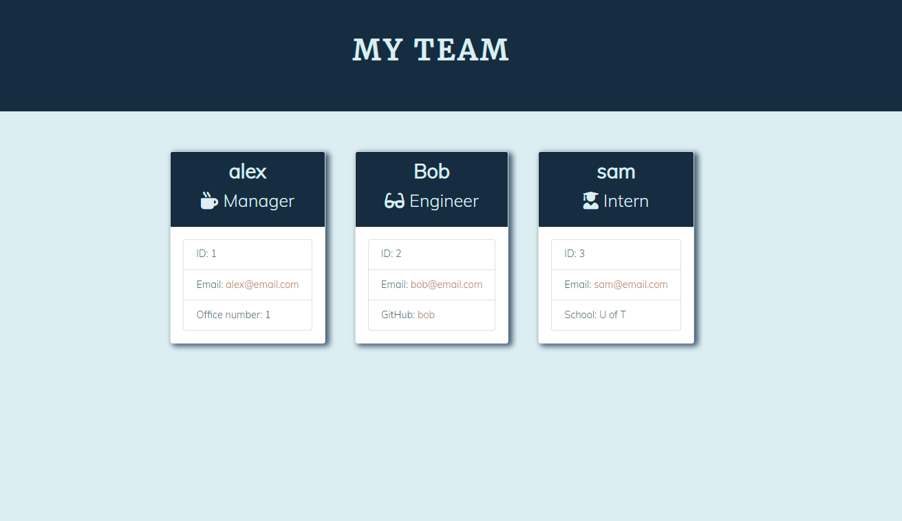

# Team-Profile-Generator

## Description

A Node.js command-line application that takes in information about employees on a software engineering team, then generates an HTML webpage that displays summaries for each person. 

## Installation

1. To use this appplication, first you need to download or clone this repository 
2. Run it under the node.js environment.  
3. you need to set up the application by running ``npm init -y`` 
4. Then use ``npm install`` to install the npm packages. 
5. Then you could invoke the application by using the following command: ``node index.js``

## Usage
- run the application by enter ``node index.js``
- Users are prompted for information about Team members
- After answer all the questions, a html file will be generated

The following image is the sceenshot of application's appearance:
- [sample HTML file](./dist/team.html)

- [Video Demo](https://user-images.githubusercontent.com/97209241/153976017-1c14d7df-b580-4823-869e-e9efbf4eb4f0.mp4)

## Contribute

Contributions, issues and feature requests are welcome.
Feel free to check [issues page](https://github.com/JotaroC/Team-Profile-Generator/issues) if you want to contribute.

## Questions

Free feel to approach me if you have any further questions or anything want to discuss.
- checkout my [GitHub profile](https://github.com/JotaroC)
- Contact me via [Email](mailto:cxz980314@gmail.com)

## License

Copyright© 2022 JotaroC.
This project is MIT licensed.
    
